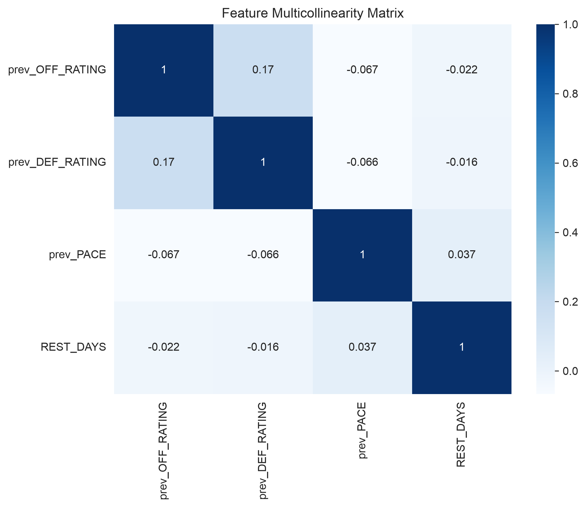
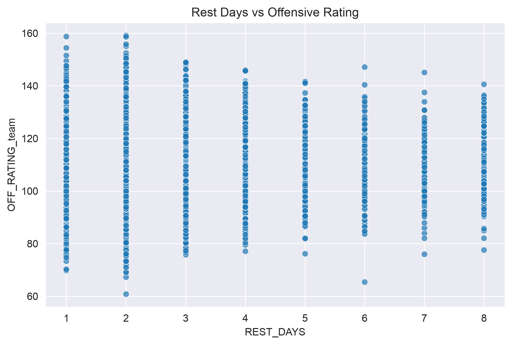

# NBA Game Outcome Predictor & Efficiency Analysis

An end-to-end data engineering and machine learning pipeline built in Python to predict NBA game outcomes using 10 seasons of historical advanced metrics and engineered rest schedules.

---

## Project Overview
The objective of this project is to model NBA game win probabilities using pre-game efficiency ratings, pace, and schedule-induced fatigue (rest days). The pipeline extracts raw game logs, structures relational matchup data, engineers time-series features without data leaks, and evaluates a Logistic Regression classifier.

---

## Data Pipeline & Architecture

1. **Data Ingestion (`nba_api`):**
   - Extracted 10 seasons of team game logs (2016–2026) using the `TeamGameLogs` endpoint with advanced measure types.
   - Built a fault-tolerant script with API throttling and automated retry logic, checkpointing raw logs directly to a local CSV vault.

2. **Relational Data Wrangling (`pandas`):**
   - Conducted a relational self-join on `GAME_ID` with custom suffixes (`_team`, `_opp`) to pair opponent stats on a single row.
   - Applied boolean masking (`TEAM_ID_team != TEAM_ID_opp`) to eliminate self-match collisions.

3. **Feature Engineering & Leak Prevention:**
   - **Chronological Rest Days:** Formatted dates to datetime objects, sorted chronologically, and partitioned franchises with `.groupby('TEAM_ID_team')` before computing `.diff().dt.days`.
   - **Outlier Filtering:** Filtered inter-season breaks (`REST_DAYS < 9`) to isolate in-season schedule fatigue.
   - **Lagged Pre-Game Metrics:** Shifted offensive rating, defensive rating, and pace by one game (`.shift(1)`) grouped by franchise to ensure the model trains strictly on pre-game knowledge rather than same-day box scores.

---

## Exploratory Data Analysis (EDA)

- **Multicollinearity Audit:** Calculated Pearson correlation coefficients across predictive features and visualized them via a Seaborn heatmap. Feature correlations peaked at `0.18`, verifying that Pace, Efficiency Ratings, and Rest Days provide distinct mathematical variance.
- **Fatigue vs. Efficiency:** Visualized the distribution of rest days across scoring metrics using semi-transparent scatter plots (`alpha=0.7`).


 


---

## Machine Learning & Evaluation

- **Algorithm:** Logistic Regression (`scikit-learn`)
- **Validation Strategy:** Chronological train/test split (`train_size=0.8, shuffle=False`) preserving the arrow of time to avoid temporal lookahead bias.
- **Feature Scaling:** `StandardScaler` applied to normalize varying units (ratings vs. rest days) for interpretable coefficient weights.

### Results
- **Test Accuracy:** **54.47%** on unseen future matchups (providing a statistically sound edge over baseline binary probability without lookahead data leakage).
- **Key Feature Insights:**
  - `prev_OFF_RATING` (+0.138) and `prev_DEF_RATING` (-0.132) carry the strongest predictive weight, confirming efficiency as the primary driver of win probability.
  - `REST_DAYS` (+0.068) provides a measurable, statistically significant edge for rested teams.

---

## Tech Stack
- **Languages & Libraries:** Python, Pandas, NumPy, Scikit-learn, Seaborn, Matplotlib, `nba_api`
- **Environment:** PyCharm / Jupyter Notebook

---

## Setup & Reproduction

1. **Clone the repository:**
   ```bash
   git clone [https://github.com/gm2350-cpu/NBA-Playoff-Prediction-Project](https://github.com/gm2350-cpu/NBA-Playoff-Prediction-Project)
   cd NBA-Playoff-Prediction-Project
